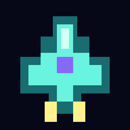
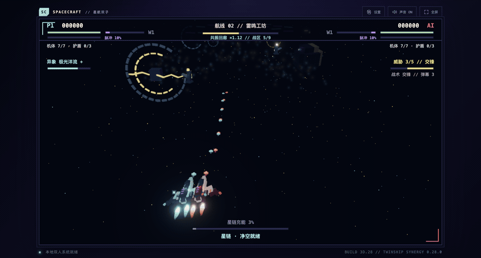
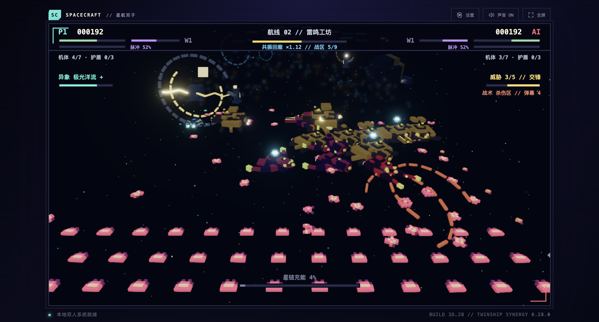
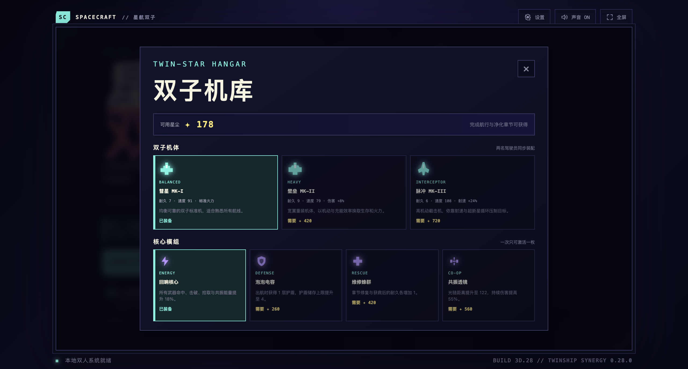

<div align="center">
  

# SPACECRAFT // 星航双子

**只需移动，火力全自动。与朋友或 AI 僚机并肩完成一场 30 分钟的 3D 深空远征。**<br>
**Move. Dodge. Stay linked. Your weapons, energy skills and rescues fire automatically.**

[](https://github.com/quater782/spacescraft/releases/latest)
[](https://github.com/quater782/spacescraft/actions/workflows/build-windows.yml)
[](#这是什么--what-is-it)
[](#操作--controls)

**[下载 Windows / macOS 最新稳定版](https://github.com/quater782/spacescraft/releases/latest)** · [查看更新日志](CHANGELOG.md) · [开发者文档](docs/README.md)
</div>



## 这是什么？ // What is it?

《星航双子》是一款离线可玩的卡通像素风 WebGL 3D 合作射击游戏。你只负责方向移动；射击、共享 Nova、星链共振和近距离救援都会自动触发。单人模式由具备闪避、集火和救援能力的 AI 僚机陪同，本地双人支持键盘或双手柄。

SPACECRAFT is an offline, pixel-styled WebGL 3D co-op shooter. Players steer while weapons, shared Nova, resonance and close-range rescues trigger automatically. Play solo with a threat-aware AI wingmate, or share one screen with a friend on keyboard or two controllers.

- **真实 3D 深空 // True 3D space:** Three.js 透视相机、体素舰船、灯光、雾、辉光和九种动态星域；不是 2D 缩放伪深度。
- **双机协作 // Twinship co-op:** 保持阵型积蓄星链，自动救援倒地队友，以走位共同破解弹幕。
- **每局可构筑 // Build every run:** 四条成长路线、23 张升级卡、7 种双组件遗物协议、三种机体与四枚核心模组。
- **会读局势的战场 // Reactive battlefield:** 三章九战区、动态遭遇、Boss、多类弹幕、自适应威胁与拥有独立战术/武器状态的敌军。
- **完整双语与 8-bit 声场 // Bilingual & synthesized audio:** 简体中文/English 即时切换；音乐和音效由 Web Audio 实时合成。

## 实机画面 // In-game

| 3D 弹幕战斗 // 3D combat | 双子机库 // Twin-star hangar |
| --- | --- |
|  |  |

## 下载 // Download

前往 **[Releases](https://github.com/quater782/spacescraft/releases/latest)**，按设备选择：

| 平台 | 推荐下载 | 说明 |
| --- | --- | --- |
| Windows 10/11 x64 | `windows-x64-Setup.exe` | 当前用户安装；也提供免安装 `portable.zip`，请完整解压后运行，不能只复制 EXE。 |
| Apple Silicon Mac | `macOS-arm64.dmg` | 适用于 M1/M2/M3/M4 及后续 Apple 芯片。 |
| Intel Mac | `macOS-x64.dmg` | 适用于 Intel 处理器 Mac。 |

Windows 10/11 x64 users can choose the installer or the portable ZIP. Keep every DLL, `resources` and `locales` folder beside the EXE. macOS builds are currently unsigned and not notarized, so Gatekeeper may ask you to confirm the first launch in **System Settings → Privacy & Security**.

> 当前为独立开发版本，尚未配置 Windows 代码签名或 Apple 公证。下载页同时提供 SHA-256 校验文件。<br>
> This indie build is not yet code-signed or Apple-notarized. SHA-256 manifests are included on the release page.

## 操作 // Controls

| 模式 | 操作 |
| --- | --- |
| 单人 // Solo | P1：`WASD`；P2 由 AI 僚机接管 // P2 is controlled by the AI wingmate |
| 本地双人 // Local co-op | P1：`WASD`；P2：方向键 // Arrow keys |
| 双手柄 // Two gamepads | 左摇杆移动 // Move with the left sticks |
| 通用 // General | `Esc` 暂停、`M` 静音、`Enter` 开始/重开 // Pause, mute, start/restart |

没有手动开火键。调整方向、躲避威胁、靠近队友；其余战斗系统自动运行。<br>
There is no fire button. Steer, dodge, and stay close—the combat systems do the rest.

## 从源码运行 // Run from source

需要 Node.js 22+：

```bash
npm install
npm start
```

也可以直接双击 `index.html`，或用静态服务器打开网页版：

```bash
python3 -m http.server 4173
```

然后访问 `http://localhost:4173`。桌面版与网页版均离线运行，存档保存在本机。

## 项目状态 // Project status

当前稳定版：**0.28.0 — 双子协同 / Twinship Synergy**。本版汇总了威胁感知 AI 僚机、敌军自由平移与智能芯片、星链协作任务卡、连续像素激光与护盾声光反馈，并启用可复现的 Windows/macOS 正式发行流水线。

The current stable release is **0.28.0 — Twinship Synergy**, bringing together the threat-aware AI wingmate, free-moving enemies and adaptive chips, Starlink mastery cards, continuous pixel lasers, richer shield feedback, and a reproducible Windows/macOS release pipeline.

- [0.28.0 发行说明 / Release notes](docs/RELEASE-0.28.0.md)
- [当前项目状态 / Current project state](docs/PROJECT-STATE.md)
- [开发与验证 / Development & QA](docs/DEVELOPMENT.md)
- [桌面打包 / Desktop packaging](docs/PACKAGING.md)
- [Steam 路线图 / Steam roadmap](docs/STEAM-ROADMAP.md)

## 参与开发 // Contributing

先阅读 [AGENTS.md](AGENTS.md) 与[文档中心](docs/README.md)。提交前运行：

```bash
npm run verify
```

仓库当前未采用开源许可证。除非另有书面授权，代码与美术素材保留所有权利。<br>
No open-source license has been granted. Code and art assets are all rights reserved unless explicitly stated otherwise.
