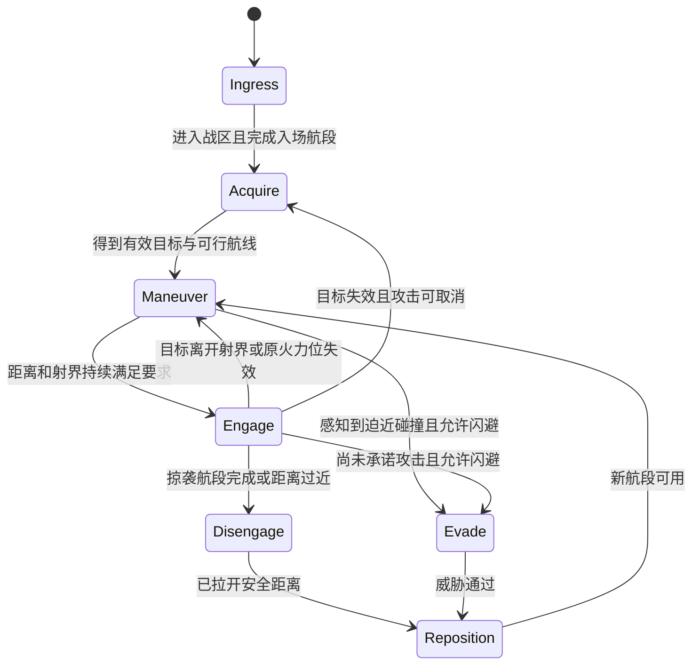

# 敌军飞行、朝向与状态机重设计

2026-09-24 当前规则已更新：芯片概率/上限为 10%/20%/28% 与 1/2/4；首章 35% 后开放。攻击锁定段保持朝向和移动矢量，炮口及射线随船平移，不再留下悬浮激光节点；芯片激光仍为 3 秒、最后 0.75 秒锁定。详见[成长与协作平衡](./BALANCE-REBASE.md)。下方 9 月 23 日规则为调整前记录。

2026-09-24 Boss 专项规则已更新：阶段阈值不再取消已承诺攻击，而是在发射结束后进入核心暴露；失去有效目标仍取消未发出的招式。Boss 章别预警、运动和增援独立于普通敌军，见 [Boss 章节设计](./BOSS-ENCOUNTERS.md)。本页较早的“Boss 时长不变”仅描述对应历史调整。

2026-09-23 时长调整：芯片敌机单束/多束激光总瞄准 3 秒（实时校准 2.25 秒 + 固定预警 0.75 秒），普通敌机和 Boss 保持原时长。

日期：2026-09-12（提案）；2026-09-13（实施）；2026-09-15（移除旧机制）。状态：**运行时已接入，机制验收通过；完整首章难度未通过**。

Major 主题：让敌人用连续飞行完成战术，机头、推进器、武器与实际攻击方向一致。玩家应能从转弯、减速、瞄准和加速看懂下一步动作，消除周期性抽动和被牵引的观感。

下方 2026-09-23 小节为最新规则，覆盖旧版停稳发射和移动/武器互斥条件，其后 2026-09-12/13 内容是原始设计依据，历史现状与候选参数不作为当前实现事实。2026-09-13 已新增 `src/enemy-ai.js`，在保留护盾、激光和星链已有修改的基础上接入全部敌军。没有调整版本、存档或安装包；验证结果与边界见[项目状态](./PROJECT-STATE.md)。

## 2026-09-23 当前规则：移动火力与多束激光协同

Major 主题：飞行和武器并行，激光根据命中或协同封路选择实际几何。普通敌机在可见战区、距离目标 300 以内即可独立对准；不再要求抵达交战站位/速度归零，不因闪避、后撤、重定位或一般接触取消武器。只有冲撞继续承诺运动航段。初始武器冷却由 1.6–3 秒改为 0.65–1.05 秒，开局前 6 秒禁火保持；稳定对准窗口为 0.1 秒。就绪较早且可发射的单位优先获得名额，保留首章 2/恢复 1、后续章节 4/恢复 2 的攻击并发、高危预算、预警和弹量限制。

普通弹在蓄力时持续随炮口更新方向，芯片预测使用剩余蓄力时间；激光炮座可独立转动。激光预警由可见悬浮发射节点提供，节点与最终射线锁定，船继续移动和躲避；芯片仍只在最后 0.75 秒前校准，普通机/Boss 保持原有完整锁定窗口。实际光束读取同一组预警坐标。Boss 横移也不再等开火结束。

多束激光（双束扫射、Boss 双轨/三轨和高阶日冕束）有两种策略：`strike` 令一束穿过瞄准点，另一束封一侧；`corridor` 在目标两侧形成近距通道，交给同目标友军跟进。普通机只有友军已承诺攻击且轮次合适时夹道；芯片能提前识别友军对准，并把中心间距由 52 收窄到 40 逻辑单位，仍留出可穿越空间。已锁定的策略不因友军死亡或玩家改向突然改写。

新增 `data-enemy-weapon-activity`（首次发射年龄/移动中攻击次数/轮次）与 `data-enemy-laser-plans`（模式/配合友军/半间距），不进入存档。没有增加手动操作、运行时依赖、版本或发行产物；保留之前的启动/声音与瞄准改动。验证记录见[项目状态](./PROJECT-STATE.md)。

## 2026-09-21 历史规则：按武器预测与激光分段锁定

Major 主题：芯片敌机使用与武器相符的瞄准策略。芯片最高移动速度在 1.18 倍基础上再增加 10%，变为同型普通机的 1.298 倍；血量、加速度、转速、生成数量与伤害维持现值。

直射/双发/扇射/狙击类攻击按目标当前速度、枪口距离、蓄力延迟与实际初始弹速求拦截时间，含模块、章节、航线、生态和动态威胁弹速倍率；预测最多 1.5 秒或 90 逻辑单位，不读取未来输入。曲线/制动弹只按初速近似，追踪、布雷和环射保留各自行为。普通机与 Boss 保留原瞄准策略。

芯片激光蓄力前段实时跟随当前目标，机身/炮座仍受转速限制；发射前最后 0.75 秒固定射线，光束沿最终预警发射。总蓄力仍至少 1.12/1.28 秒，期间不切换目标、不允许闪避改写攻击，目标倒地则取消。`data-enemy-chip-aim` 区分 acquiring/tracking/locked。固定步边界最多一个 1/60 秒的采样误差，实际最后一次校准距发射不短于 0.75 秒。

验证证据与边界见[项目状态](./PROJECT-STATE.md)。

## 2026-09-19 历史规则：可辨识的智能精英

Major 主题：芯片敌人能完成避险→重新交战→真实发射，增强机体能力并让意图可读。

- 三章芯片概率为 **14%/22%/28%**，在场上限 **2/3/4**；首章 25% 前、成长缓冲期间仍不生成，Boss 不随机装配。独立种子抽取不消耗战斗随机流。
- 同型基础机的血量 ×1.25、最大移速 ×1.18、转速及角加速度 ×1.30、推进加速度 ×1.35、制动 ×1.25。保留现有伤害、弹速、射击冷却、预警时长、总敌机/弹量与攻击并发预算。芯片不是额外的伤害倍增器。
- 保留有限预测、空位评分和提前避弹；横向选位投影回可达射程，避免侧袭/伏击叠加偏移后一直无法进入交战。闪避最多 0.65 秒，结束后重新开始 2.2 秒闪避冷却；芯片重定位/脱离最多 1.1 秒后重评估，避免持续来弹导致无限逃跑。
- 低于 45% 血量且观测到当前位置受弹道威胁时，在两侧后方候选点中选择低风险点防御后撤，6 秒冷却；不回血、不无敌、不读取未来输入。预警与发射承诺不能被闪避/防御改写。
- 所有普通机型在对准时制动并锁定位置，实际速度低于 0.04、对准持续 0.15 秒且获得攻击名额后才进入预警。修复炮座机一边移动一边等待停稳，以及残余漂移取消冻结发射的问题。
- 放大背部芯片，增加永久双翼电路灯条；洋红待机、前部红灯攻击、长黄灯闪避、后部蓝灯防御后撤。颜色与灯的位置/长度共同编码，低画质也绘制；扫描说明同步中英。
- `data-enemy-chips` 保留原五项并追加防御次数、攻击轮次：`id|chip|decisions|evades|reason|defenses|cycles`。这些只属于局内状态，不修改 profile。

验证与边界见[当前项目状态](./PROJECT-STATE.md)。下方保留历史参数，以上规则优先。

## 2026-09-15 历史规则：自由平移与自适应智能芯片

Major 主题：让移动立即响应意图，让少量敌人通过决策表现出更强智能。

- **所有敌机都能前进、倒退、横移。** 平移不再乘机头夹角或等待掉头；机头跟随目标，只有已经承诺的冲撞必须沿机头轴线前冲。普通职责转速为 2.2–5.4 rad/s，Boss 为 1.7 rad/s；转向响应和角加速度同步加快，仍受固定步和能力上限约束。
- **减少机械往返。** 删除突击/侧袭每轮完成射击后的固定绕回段；距离过近才退让，保持面对目标。站位目标忽略 6–18 单位内的小幅扰动，接近站位时渐进减速。所有机型有实际反推/侧推表现，前进喷焰不再直接等于速度大小。
- **稀有自适应芯片 `adaptive`。** 普通敌机额外随机搭载，不占用现有六个装配维度，不改其构筑 ID、耐久、伤害、速度或掉落。以 run seed 和敌机 ID 独立派生，重放可复现，不消耗战斗或掉落随机流。
- **生成边界。** 首章进度不足 25% 不出现；三章基础概率为 10%/18%/24%，同时在场上限为 1/2/3，成长缓冲期间不生成新芯片。Boss 不随机装芯片。首章普通攻击并发上限为 2，恢复段为 1，芯片敌人照常占用名额；后两章维持 4/2。
- **更好的决策。** 芯片以 0.12–0.18 秒间隔感知，按已观测速度增加有限提前量，总瞄准预测不超过 0.65 秒；在三条候选射位中比较附近同伴/同伴目标槽与可见玩家弹道，评分改善足够且最短 0.75 秒评估间隔到达后才换位。提前检查 0.22–0.75 秒内可能相交的弹体，选择较空且远离边界的闪避侧，闪避冷却为 2.2 秒。看不到未来输入，预警和发射期间不能靠闪避改写承诺。
- **可识别表现。** 背部洋红电路板和双白触点在低画质仍绘制；首次出现必定触发中英扫描说明和三音识别声，后续扫描受间隔限制，不产生牵引环或吸附粒子。

运行时增加 `chipId/chipLaneOffset/chipDecisions/chipEvades/chipReason`，均不进入永久 profile。`#game` 增加 `data-enemy-chips`、`data-enemy-chip-count`、`data-enemy-chip-cap`；3D 朝向标记改为 `target-facing-omnidirectional-thrust`，芯片标记为 `adaptive-dorsal-circuit`。验证结果见[当前项目状态](./PROJECT-STATE.md)。

## 2026-09-13 实施规则（历史，运动模型以本页当前规则为准）

- 七战术状态、目标 1.2 秒持有/0.2 评分迟滞、错相 0.16–0.24 秒感知、六 AI 偏好、四推进差异、七职责与九原生种均通过共同控制器执行。旧六态、`COMBAT.nextState/stateDuration`、职责旧时序表、多处写位置/周期回位分支全部删除；职责能力与武器时序只在新控制器中定义。
- `vx/vy` 成为真实速度，统一受限加速度/角速度/角加速度积分；前推机沿机头推进，悬浮单位允许可见侧推。边界提前制动，接触修正每对每步至多 0.65 单位；仅相对闭合速度超过 45 的真实接触产生互撞伤害/声光，旧冲撞招式名不再触发伤害。
- 武器独立冷却、对准、预警、发射；短预警采用稳炮，以保证读取窗口。射击结束不强制回位；突击/侧袭按完成掠袭航段脱离。激光保留至少 1.12/1.28 秒预警，冲撞至少 0.85 秒；全场预警错开 0.22–0.29 秒，延续原攻击/高危预算。
- 发射挂点、逻辑坐标和 WebGL 非等比映射共用 `SpaceEnemyAI`；预警和伤害束读取同一冻结射线。机体与可转动炮座跟随实际朝向，推进/侧推随运动变化。死亡目标不被追踪弹重新换锁。
- 冲撞按机头方向规划边界内可达航段，穿越后制动回转；全机通用蓄力环和吸附粒子删除，冲撞显示覆盖接触半径的走廊。弹墙/夹击保留原有轨迹与安全口，以预警期间已出现的远端发射节点解释来源，节点位置到发射时保持不变。
- Boss 三阶段/招式和预算保留，横移改为受限飞行，对准并制动后才开始预警，光束存续时保持炮位，阶段切换清掉旧承诺。多束发射器明确显示各自枪口。
- 诊断新增实际战术/武器状态、换目标次数、边界/接触修正和朝向速度。计数摘要是当前存活敌军的合计；旧状态字段、兼容映射和旧诊断属性全部删除。普通敌机与 Boss 统一使用 `weaponState/weaponTimer/weaponDuration/weaponAge/weaponCharge`，Boss 不再另设开火保持计时器。
- 新 `npm run smoke:enemy-ai` 集中覆盖各船体、Boss、锁定几何、真实 WebGL 和双模式正常开局；`npm run verify` 加入运动/目标/坐标/冲撞路径的行为验证。16 船体/三章 Boss 机制、共享预警/伤害射线及双模式开局已检查；正常首章长样本在 419.12 秒全灭，完整难度验收未通过，具体边界见项目状态。

## 1. 原始问题证据（2026-09-12 历史记录）

| 问题 | 源码证据 | 对体验的影响 |
| --- | --- | --- |
| 机体没有跟随飞行或瞄准转向 | [renderer3d.js](../src/renderer3d.js) 的 `drawEnemy` 将 yaw 固定为 `Math.PI`，只叠加星镰轻摆和画廊旋转；武器挂点也没有独立瞄准角 | 横移、后撤、冲锋时仍以原方向面对玩家，弹药可以从固定朝向的口器向侧面射出 |
| 所有角色重复短周期 | [combat.js](../src/combat.js) 的 `STATE_SEQUENCE`、`nextState`、`stateDuration` 由计时器推动占位→预警→攻击→脱离/重组 | 尚未到位也会开火，开火后无论空间是否合适都进入下一段移动 |
| 多套逻辑同时改位置 | [game.js](../src/game.js) 的 `updateEnemy`、`updateEnemyTactics`、`updateEnemyIntelligence` 分别叠加速度、正弦漂移、位置插值和横向闪避 | `vx/vy` 并不代表完整真实位移；切状态会换位移公式，没有统一加速度、转向和制动限制 |
| 攻击后回到另一套纵深锚点 | `position` 读取玩家相对距离，`breakaway` 又插值到 `stationY + stationYBias + 34`，随后再回玩家相对位置 | 轻型机每轮可能前冲、被拽回、再靠近，产生重复拉扯 |
| 目标和编队容易突变 | `enemyTarget` 每次重新比较目标，没有持有时间；`pack` 会因同伴蓄力压短占位计时器 | 两机交错、血量或速度变化时换目标；集群容易同步抽动和齐射 |
| 碰撞分离附带强反馈 | `resolveEnemyCrowding` 直接推坐标；敌敌碰撞另执行至少 8 单位的位置分离并播放爆炸粒子 | 两敌靠近时确实可能突然弹开并伴随可见效果；旧 `attackPattern === ramCharge` 还能在攻击结束后继续满足碰撞条件 |
| 冲撞规划与活动边界冲突 | `attackEndY` 可达 `H + 24`，非入场位置却被钳制到 `H - 58` | 某些终点永远到不了，冲刺会顶住边界，换状态后又向上回位 |
| 蓄力效果重复且像吸附 | `drawEnemyTelegraph` 普通攻击显示局部环，激光/冲撞显示向口器聚拢的粒子；`drawRamWake` 显示短尾迹 | 周期位移切换叠加环和汇聚粒子，会强化“有外力牵引”的观感 |

上述是源码确认的机制，尚未用用户所见片段逐帧定位哪一种效果。检查到的常规敌机更新链没有周期性把敌人吸向玩家的通用牵引力；拾取物的磁吸属于独立系统。不能把用户描述武断归因于某个特效，实施时应同时记录状态切换、碰撞修正和效果事件。

## 2. 总体结构：三层分工

1. **战术层**决定目标、职责站位、切入航线和何时脱离。只输出意图，不写坐标。
2. **飞行层**以统一速度、加速度和转向限制执行意图。只由这一层积分常规位置；真实碰撞由专门结算器修正并记录原因。
3. **武器层**独立处理跟踪、对准、预警、发射和冷却。开火不强制触发脱离；渲染只读取最终姿态和攻击几何。

同一架敌人可以一边绕行一边冷却，也可以保持稳定火力位连续两次攻击。计时器只用于感知间隔、动作最短承诺、预警/冷却和失败超时，不能单独决定敌人突然换轨。

## 3. 战术状态机

图展示主要路径；下表和中断优先级定义完整规则。任何状态都可因死亡终止，目标失效可回索敌，但已承诺的攻击遵守第 5 节。

| 状态 / 稳定 ID | 进入条件与职责 | 退出条件、失败处理 |
| --- | --- | --- |
| 入场 `ingress` | 从生成点沿可行航段进入；编队延迟控制出发，初速度和初朝向沿入场方向 | 进入合法区域并完成航段后索敌；航段不可达则重规划，禁止定时瞬移到站位 |
| 索敌 `acquire` | 在继续安全巡航的同时选择存活目标；保留上次航向 | 目标与航线可用才进入机动；无目标则巡航停火，战役结束交由世界清理 |
| 机动 `maneuver` | 逼近交战距离、建立侧翼、伴随领机或寻找布雷位置 | 满足距离、射界和稳定时间后交战；超时换候选航线，不强行攻击 |
| 交战 `engage` | 保持岗位或完成一次掠袭；武器独立运行 | 火力位失效才换位；掠袭完成、距离过近或队列让位才脱离，单次开火结束本身不是退出条件 |
| 脱离 `disengage` | 沿预先选择的一侧转弯、制动或继续穿越，建立下一次攻击空间 | 安全距离达到且离开已承诺航段后重定位；禁止插值回旧站位 |
| 重定位 `reposition` | 选取当前可达、未被占用的新航段或相对编队位置 | 新航段建立后进入机动；避开上一失败航线，持续失败则安全盘旋再评估，存活敌人不按秒数消失 |
| 闪避 `evade` | 只响应感知范围内、预计会相交的弹体或机体；有反应延迟、转向上限和冷却 | 威胁通过后重定位；不能每帧左右翻转，也不能用闪避取消已承诺冲锋来追玩家 |

中断优先级：死亡/转场清理 → 实体碰撞与边界安全 → 已承诺攻击 → 可用的紧急闪避 → 目标失效 → 职责机动。安全约束不会因蓄力而关闭；若必须中止蓄力，应清除对应预警并进入取消冷却，不能一边躲避一边突然改射线。

候选决策参数：每架以 `dt` 累积到 0.16–0.24 秒重新感知，初相位由 run seed、敌机 ID 派生；目标最短持有 1.2 秒，新的归一化评分至少高 0.2 才换目标，失效目标立即释放。交战条件持续满足 0.15 秒才准许武器申请攻击。进入交战使用内距离带，退出使用更宽的外距离带，避免边缘反复横跳。这些是首轮调参起点，非实测结论。

## 4. 连续飞行与机体姿态

### 4.1 唯一运动执行器

- 常规更新顺序为感知→战术意图→攻击约束→转向/推进→位置积分→接触处理→生成最终发射几何→渲染快照。
- `vx/vy` 保存实际速度；状态切换只改目标航向/速度，保留已有速度、角速度和倾斜角。攻击回调不得直接改位置或瞬间反转速度。
- 路线跟随、编队保持、避让和边界制动统一生成有上限的加速度请求。采用优先级分配，先满足边界和碰撞安全，再把剩余能力用于职责机动；不叠加多段位置插值。
- 转向具有最大角速度和角加速度；速度具有最大值、推进加速度和制动上限。转弯半径受当前速度与转向能力限制。蛇形/漂移模块修改航线曲率、侧推能力或转向参数，不额外对坐标叠加正弦。
- 边界提前按制动距离 `v² / (2 * brakeAccel)` 加机体半径和转弯余量选择回转点。最终硬限位只作为异常兜底，每次触发记录，正常路径目标为零次。
- 群体提前预测短时相交并让路；正常分离不播放能量环或爆炸。真实接触仍保留碰撞伤害与反馈；以接触事实、相对速度和冷却决定事件，不能依据上一轮遗留的招式名制造持续碰撞。

### 4.2 飞行与瞄准的关系

| 运动类型 | 机体朝向 | 瞄准方式 | 视觉反馈 |
| --- | --- | --- | --- |
| 有前向推进的战机 | 机头顺着受限转向后的推进方向；转弯有短暂惯性偏航 | 固定机炮要求机头进入射界，禁止侧身向背后开枪 | 转弯压低内侧机翼；尾焰随推力增强，制动时减弱 |
| 悬浮重型/布雷单位 | 朝向主要威胁并以有限侧推维持距离；低速时保持朝向，不从零速噪声算角度 | 只有具备可见关节的武器允许有限独立转动；超过射界须带动船身 | 对应侧推器点亮，船体轻倾，不能像贴图平移 |
| 冲撞单位 | 承诺后机头、速度和预警航线一致 | 撞角不独立转向 | 启动时后方喷焰增强，尾迹仅沿真实经过路径出现 |
| 环射/母巢单位 | 船体按飞行或主要威胁缓慢转向 | 环形炮座、育舱和分布发射口解释多方向发射 | 设备局部旋转；整个船身不因环弹相位而无故自旋 |

候选能力范围：轻型最大转速 100–150°/秒、倾斜上限 18°；侧袭 130–170°/秒、倾斜上限 22°；重型/指挥 40–65°/秒、倾斜上限 8°；悬浮武器局部射界起点为左右各 35°。角加速度与推进参数应随角色一起标定，不能只抬高转速让机头瞬间黏住玩家。非漂移战机的持续侧滑应收敛，停稳后倾斜平滑回正。

### 4.3 坐标与发射口必须一致

当前逻辑平面是 480×270，`toWorld` 对 X、Y 分别除以 21.5、13.3 映射到世界 X、Z。直接把 `atan2(vy, vx)` 当 3D yaw 会造成斜向误差。以逻辑方向 `(dx, dy)` 为例，先得到世界方向 `(dx / 21.5, dy / 13.3)`；模型鼻尖为本地 `-Z` 时，yaw 使用 `atan2(-dx / 21.5, -dy / 13.3)`，再按最短角差连续转向。不同模型若有初始朝向差，用显式模型轴偏置处理。

模拟持有逻辑朝向与角速度，渲染对投影后的世界方向计算姿态；发射口变换使用同一坐标映射的逆变换，避免逻辑旋转和非等比世界映射各算一套。拟把坐标换算与必要的发射挂点数据抽成共享纯数据/函数，由 `game.js` 计算实际发射口和轴线，渲染读取结果。表现性的翼摆、后坐和小幅俯仰不改碰撞中心，也不让枪口明显离开实际弹道。

## 5. 武器状态机与攻击承诺

`冷却 cooldown → 对准 align → 预警 windup → 发射 fire → 冷却 cooldown`

- 冷却计时在各战术状态中正常推进；到期只表示可申请对准。入场、无有效目标、不在射界时仍不攻击，也不积攒补发齐射。
- `align` 受机头/炮座真实转速约束。对准、距离和导演攻击名额同时可用才进入 `windup`；未获得名额继续原有飞行，不伪造蓄力或强制进入重组。
- 对准门槛候选为方向误差 ≤8–12°，精确武器更严；预警期间必须持续满足该武器的承诺约束。取消只释放尚未发出的名额并进入短冷却，不立即重新爆发。
- `fire` 只结算一次发射事件。持续激光或连续喷射以独立持续时间结束，伤害继续读取实际射线；死亡与真正的状态取消不能留下无主预警。
- 普通弹维持局部口器蓄力和现有角色最短读取窗口；把进入预警的条件变合理，不以删除预警提速。精确攻击保留当前激光至少 1.12/1.28 秒的窗口。

| 攻击族 | 对准及锁定规则 | 对应动作与发射位置 |
| --- | --- | --- |
| 点射、双联、扇射、雷枪、扫射 | 对准后固定本次瞄准解；预警后不重新采样玩家来偷改方向。运动射击使用固定轴线和当时实际枪口 | 沿当前枪口前向发射，散布围绕炮轴；扫射只沿已显示的有限扫角，不瞬转向身后 |
| 单/双激光 | 先制动稳住，再锁定实际起点、方向和束宽；整段预警与伤害共用同一几何 | 船身/炮座维持轴线至激光结束；因安全避让或碰撞破坏几何时取消尚未发射的攻击，重新预警后才可再射 |
| 追踪弹 | 发射时面向可见发射方向，只锁定目标身份；离架后沿现有制导时限、转向限制追踪 | 从真实弹舱推出再转弯，不能从侧后方凭空出现；发射后目标失效不瞬间换锁另一玩家 |
| 爆破弹、种雷 | 锁定落点/投放段及实际范围；引信、碎弹和伤害继续共用已实现规则 | 从腺体或腹部口落出；危险环绑定落点/弹体，不围着整架敌机收缩 |
| 环射、双螺旋、精英光环 | 设备朝向和环射相位独立，环形攻击不要求船身指向每枚弹 | 分布口、环形器官逐处亮起，局部形体解释全向火力 |
| 弹墙、夹击、指挥十字/齐射、精英交叉 | 保留安全口与预算；横跨屏幕的发射点必须有明确来源 | 后续接入需定义提前可见的远端发射节点/编队发射口，或改为本机发射后展开。第一步保留原轨迹时也必须补足来源表现，不能声称所有弹已从鼻尖发射 |
| 冲撞 | 确认可达航段与制动空间→对准→固定走廊预警→加速穿越→减速回转 | 冲锋中不再采样玩家坐标；按沿航段进度判断已越过终点，避免越过后反复追终点。边界内规划可达终点，不与硬钳制冲突 |

普通运动射击的枪口可以沿平行轨迹移动，因此只展示局部蓄力；激光与冲撞显示完整危险区域，必须明确承诺几何。冲撞预警宽度需覆盖机体接触半径，不能只用一条细线表示全部危险区。

## 6. 七职责、九原生种与六 AI 模块

### 6.1 七种职责的交战方式

| 职责 | 连续行为 | 何时换位 / 玩家可读的反制 |
| --- | --- | --- |
| 截击 `interceptor` | 以短弧接近可射击航道，对准后点射；有机会可保持航道再打一轮 | 目标越过射界或距离过近才转弯，玩家横移能让其重新对准 |
| 突击 `striker` | 建立一次完整斜向掠袭，在通过时开火，顺势转弯脱离 | 以通过攻击航段为结束条件；不在射击结束瞬间倒滑回去 |
| 壁垒 `bulwark` | 朝向威胁，侧推保持宽距离带，稳住后展开重火力 | 玩家压近或侧翼被突破才后撤并转体，笨重但持续占位 |
| 炮击 `artillery` | 沿后方宽弧缓慢巡航，炮座完成对准或环射 | 原射界长期失效才换弧，激光稳炮期间为明显攻击窗口 |
| 拒止 `denial` | 选择尚未覆盖的区域，沿投放航段布雷 | 完成布设或该区域已有己方危险物后换区，不追着玩家贴脸下雷 |
| 侧袭 `flanker` | 选一侧切入，以有限弧线建立侧射角 | 航线被堵或侧袭完成后再选下一侧，同一航段不反复换左右 |
| 指挥 `command` | 后方保持阵位，给小队分配目标/航段和轮射顺序 | 阵位失效才整体迁移；成员脱离时其他成员维持压力，形成轮换 |

### 6.2 原生种绑定专长

| 原生种稳定 ID | 在上述职责之上的专属行为 |
| --- | --- |
| `nectarMoth` | 集群弧线伴飞、交替释放追踪弹；扑翼随加速和转弯改变 |
| `prismRay` | 宽弧游弋后稳炮释放双激光，鳍翼解释制动与转体 |
| `cometRammer` | 专用冲撞航段；蓄力朝向、冲刺速度与身体完全一致 |
| `auroraLeech` | 先建立侧翼，再稳住激光轴；不能一边追贴一边持续改射线 |
| `railBeetle` | 重型侧推、前部对准、固定落点爆破；无轻型掠袭回位 |
| `reefMedusa` | 悬浮转体后布设近距区域；伞体可起伏，碰撞中心不随装饰跳动 |
| `eclipseReaper` | 贴边观察→单侧切入→释放追踪弹→弧线脱离 |
| `graveMirror` | 保持后方射界，转动镜面/船身后锁定激光，释放后再迁移 |
| `gardenSpore` | 后方分区投放孢子，协调轮射；育舱负责发射，不让船体无故抽动 |

安装武器保持既有身份；原生招式由对应身体器官执行，不因状态切换把已安装武器模型替换掉。保留现有核心、载荷、死亡机能和解锁节奏。

### 6.3 AI 模块只修改决策

- `sentry`：最近有效目标、较长持有和保守航线。
- `hunter`：偏好低耐久目标，但仍受转向和持有时间限制。
- `flanker`：按两位存活玩家之间的实际距离、可达侧翼评价孤立程度；修正当前用“离屏幕中心远”代替孤立的含义。
- `oracle`：按已观测速度有限预判；不能读取未来输入，不能每帧完美躲弹。
- `pack`：共享目标和稳定编队槽，领机失效后确定性补位；按轮射预约错开攻击，删除同伴蓄力就压短全队倒计时的机制。
- `ambusher`：等待进入可达截击窗口，再承诺一条切入航线；没有窗口时沿边巡航，不能周期性横跨屏幕追点。

编队槽随领机航向连续移动，重分配仅在成员失效、航线阻断等事件发生；新槽位用飞行层转过去，不硬贴。感知相位、侧袭选择和候选顺序由确定性派生随机决定，不因渲染帧率或粒子数量改变。

## 7. Boss 与导演

Boss 保留已有三阶段、阶段盾、招式目录和章节火力设计；它也需要自然朝向，但不强行套用轻型敌机的掠袭行为。阶段监督器选择攻击，飞行层控制缓慢横向航行/转体，炮座执行同一对准和承诺规则。远端多束激光、双轨/三轨武器各有明确发射口；阶段切换取消旧预警、释放预约，再开始新动作。旧正弦坐标直接赋值改为受限路线跟随。

导演负责“多少敌人可以攻击”，不负责每架敌人如何运动。沿用当前普通弹、高危来源与活跃攻击并发预算，Boss 预算单列；第一章的教学保护不能被新状态绕过。预约在真正开始预警前获得，死亡、取消、发射完毕时按语义释放；在场激光/爆破载荷继续占用其危险预算，不能因发射者冷却而提前释放。

攻击名额释放采用稳定顺序和错峰准入，候选间隔 0.2–0.35 秒，防止等待者同帧倾泻。排队期间保持飞行，不播放假预警。此数值与所有新机动参数一起走首章难度验收。

## 8. 视觉与音效规则

- 普通换位、转弯、避让、重定位仅使用对应推进器、翼面和惯性倾斜，不生成环、牵引线、聚拢粒子或爆炸。
- 普通射击用局部炮口增亮和短促后坐；删除覆盖整机的通用周期蓄力环。
- 激光保留锁定射线与局部武器蓄能，粒子只在器官附近活动；冲撞蓄力改由尾部发动机逐渐点亮和前向危险走廊表达，取消向机鼻汇聚造成的吸附暗示。
- 冲刺尾迹沿真实路程留存；普通回转不沿用冲撞尾流。爆炸圈只表达真实爆炸范围，碰撞闪光只表达真实碰撞事件。
- 倾斜围绕机体局部前轴，俯仰只在加速/制动时短暂变化；保留像素几何、体积、深度测试和可识别的眼核/武器轮廓。
- 多层 Web Audio 分别表达普通点射、精确锁定、发动机加力和碰撞；全体普通预警不再重复同一个 `enemyCharge`。静音和效果强度设置继续有效。
- 新玩家提示与 ARIA 文本如有增加，统一进入 `i18n.js`，同步简中/英文；功能图标继续为 SVG 或矢量几何。

## 9. 实施顺序与工程落点

| 步骤 | 交付闭环 | 主要落点 |
| --- | --- | --- |
| A：连续飞行和朝向 | 截击、壁垒、冲撞三种代表能够自然转向、制动和对准；坐标映射/枪口共用事实来源，消除多处写位置 | `game.js`、`renderer3d.js`；拟新增共享运动/发射几何纯函数模块 |
| B：替换统一循环 | 接入事件驱动战术、独立武器状态、目标迟滞、避让和边界规划；删除旧回位分支和同步倒计时 | `combat.js`、`game.js`；可抽 `enemy-ai.js` 承载纯决策，世界仍由 `game.js` 持有 |
| C：覆盖全敌军 | 七职责、九原生种、六 AI、四推进模块和 Boss 接入；安装武器/招牌器官/远端发射来源解释完整 | `expedition.js`、`game.js`、`renderer3d.js`、必要的 `i18n.js` |
| D：实机标定 | 检查第一章正常速度体验、两机交错与救援、完整 Boss 转场、密集编队；根据实际命中压力调机动节奏 | 既有烟测入口及[开发与验证](./DEVELOPMENT.md) |

A/B 是实现阶段，不代表全套工作已经完成。必须覆盖 C 并取得 D 的相应证据后，才可把该提案标为已实施。新增模块同时更新 HTML 资源引用、打包依赖检查及架构文档；不添加远程运行时依赖。

建议运行时字段：`tacticState`、`stateReason`、`stateAge`、`targetId`、`targetHold`、`pathId`、`pathProgress`、`desiredVelocity`、实际 `vx/vy`、逻辑 `heading/turnRate`、`bank`、`weaponState`、`weaponAim`、`attackCommit`、`reservationId`。它们不写入 profile；2026-09-15 已删除旧 `aiState`、`attackState`、对应时长/年龄、旧出生开火计时和转向系数；目标选择、渲染、诊断与全部测试消费者直接读取新系统，没有别名、双读或回退兼容层。

## 10. 验收与边界

| 场景 | 必须观察的结果 |
| --- | --- |
| 三代表单机转向/停止/180°换向 | 速度和角速度受限，船身转弯与倾斜连续；前推机不长期侧滑，重型侧移有侧推器反馈，零速不抖朝向 |
| 两玩家交错、受伤、倒地 | 非失效目标不每帧跳换；取消或沿原方向完成已承诺攻击，绝不瞬间转打另一架 |
| 开火→冷却→下一轮 | 稳定火力位可以继续交战；普通敌人不会每隔几秒被拉回同一个锚点，也不播放换位光环 |
| 激光/冲撞预警 | 预警、枪口、实际伤害几何一致；锁定后横移有明确反制，冲撞越过终点后不掉头追终点 |
| 屏幕边界与密集编队 | 提前让路/转弯，常规路径无硬限位；实际碰撞修正和粒子都有事件来源；聚集不会导致周期爆炸式弹开 |
| 七职责/九原生种/六 AI/四推进 | 覆盖每类行为与高风险组合即可，不穷举 43,008 构筑；机体、武器、原生器官不互相矛盾 |
| Boss 三章代表动作与阶段切换 | 机体和各炮口方向合理，旧预警不会跨阶段残留，Boss 与普通军团预算不互相绕过 |
| 固定时间步/低高帧率 | 相同 seed 和输入下的模拟行为不受渲染频率影响；三档画质不改变预警与攻击结果，粒子无越界 |
| 正常首章 | 先检查 6 秒停火及前 20 秒，再实玩到首章 Boss 和转场；20 秒无伤或短时 AI 存活不能代替首章通过 |

最小新增诊断拟为 `data-enemy-tactic-states`、`data-enemy-weapon-states`、`data-enemy-target-switches`、`data-enemy-boundary-corrections`、`data-enemy-contact-corrections`。本地受控片段另记录敌机 ID、切换原因、速度、朝向误差和攻击几何，用来区分真实碰撞、状态抽动和纯视觉。无需在正式 HUD 显示工程字段。

实施时用同 seed、相同成长路线比较实际弹数、开火间隔、命中/碰撞次数、倒地/救援和首章进度。更自然的瞄准可能提高敌方命中率，因此不能因弹速、伤害未改就宣称难度不变；先调对准承诺、攻击窗口和并发节奏，再决定是否另行调整数值。

以上是设计时定义的验收标准。2026-09-13 实施后执行的真实结果记录在[项目状态](./PROJECT-STATE.md)与[更新日志](../CHANGELOG.md)；未执行的项目继续明确列为缺口，不重复构建或检查发行包哈希。
